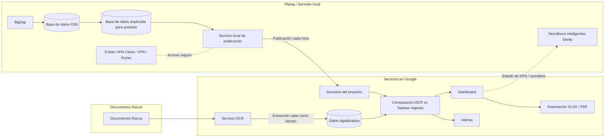

# Arquitectura de solución – Tarjetas viajeras y OCR

Este documento organiza las notas de arquitectura para el proyecto, considerando dos fuentes principales de información:

1. **Tarjetas viajeras desde BigZap**, extraídas desde la base de datos FDB en el servidor Windows.
2. **OCR de documentos físicos**, procesado en Google junto con el resto del proyecto.

La solución debe permitir comparar ambas fuentes de información para detectar discrepancias entre lo registrado en tarjetas viajeras y lo extraído mediante OCR.

---

## 1. Fuentes de verdad

### 1.1 BigZap / Tarjetas viajeras

La información de tarjetas viajeras se extraerá del servidor Windows donde corre **BigZap**.

Para esto se creará un servicio en el servidor que publique cada hora la información de la base de datos **FDB** hacia los servicios de Google.

Durante la etapa de pruebas:

- Se duplicará la base de datos en el servidor.
- El servicio de publicación trabajará sobre esa base duplicada.
- El objetivo es probar la extracción y publicación sin afectar directamente la base de producción.

### 1.2 OCR / Documentos físicos

La otra fuente de verdad será el **OCR**.

Este servicio extraerá información de documentos físicos cada cierto tiempo y digitalizará la información obtenida.

El servicio de OCR correrá en Google junto con el resto del proyecto.

La información extraída por OCR deberá corroborarse contra la información de las tarjetas viajeras para observar discrepancias.

---

## 2. Flujo general de información

1. BigZap mantiene la información de tarjetas viajeras en la base de datos FDB.
2. Para pruebas, se duplica la base de datos dentro del servidor Windows.
3. Un servicio local consulta la base duplicada.
4. El servicio publica cada hora la información hacia Google.
5. En paralelo, el servicio OCR en Google procesa documentos físicos cada cierto tiempo.
6. La información OCR se digitaliza y se almacena dentro del proyecto.
7. El sistema compara la información del OCR contra la información de tarjetas viajeras.
8. Las discrepancias se muestran en el dashboard para revisión.

---

## 3. Diagrama de arquitectura

---

## 4. Comparación OCR vs tarjetas viajeras

El sistema debe corroborar la información extraída por OCR contra la información proveniente de tarjetas viajeras.

La comparación debe servir para observar discrepancias entre ambas fuentes.

Ejemplos de discrepancias a revisar:

- Información presente en OCR pero no encontrada en tarjetas viajeras.
- Información presente en tarjetas viajeras pero no encontrada en OCR.
- Diferencias entre datos extraídos por OCR y datos registrados en BigZap.
- Tarjetas viajeras con horarios duplicados.
- Atrasos detectados entre lo registrado y lo observado.

---

## 5. Producción horaria

Se debe evaluar cómo se va a controlar realmente la producción horaria dentro del sistema.

Puntos a considerar:

- Definir cómo se medirá la producción por hora.
- Detectar y alertar cuando existan dos tarjetas viajeras en el mismo horario.
- Manejar el estado de producción con un esquema tipo semáforo.
- Evaluar el uso de desviación estándar para analizar variaciones en la producción.
- Mantener un registro del motivo por el cual existe atraso.

---

## 6. Semáforo de producción

El sistema debe manejar un semáforo visual para representar el estado de la producción.

Se debe evaluar:

- Cómo se calculará el estado del semáforo.
- Cómo se mostrará dentro del dashboard.
- Cómo se relacionará con los KPIs.
- Si es posible controlar semáforos físicos mediante SDK.

También se debe evaluar la integración con los semáforos inteligentes **Shelly**, ya existentes en planta.

---

## 7. Alertas

Se debe evaluar la implementación de alertas automáticas.

Alertas consideradas:

- Alerta por dos tarjetas viajeras en el mismo horario.
- Alertas por atraso.
- Alertas por discrepancias entre OCR y tarjetas viajeras.
- Alertas por WhatsApp a:
  - Jefes.
  - Coordinador de producción.

---

## 8. Registro de atrasos

El sistema debe permitir mantener un registro del motivo por el cual una tarjeta viajera o proceso presenta atraso.

Se debe guardar el motivo del atraso para poder consultarlo posteriormente y relacionarlo con la producción horaria.

---

## 9. Gráficas y visualización

Se debe ampliar la sección de gráficas del dashboard.

Puntos a considerar:

- Subir/agregar más gráficas.
- Manejar esquema de color en KPIs.
- Representar visualmente los estados de producción.
- Usar colores para facilitar la interpretación de los indicadores.
- Mostrar discrepancias entre OCR y tarjetas viajeras.

---

## 10. Usuarios

Agregar más datos por usuario dentro del sistema.

Campo adicional requerido:

- Teléfono.

Este dato se relaciona con la posibilidad de enviar alertas, especialmente por WhatsApp.

---

## 11. Módulo de auditorio / auditoría

Agregar un módulo de auditorio.

Posiblemente se refiere a un módulo de auditoría, especialmente por la nota relacionada con edición de OCRs pasados.

Este módulo debe relacionarse con:

- Cambios realizados por personal autorizado.
- Registro del motivo de edición.
- Control de modificaciones sobre información anterior.

---

## 12. Edición de OCRs pasados

Permitir edición de OCRs pasados solo por personal autorizado.

Requisitos:

- El personal autorizado podrá editar OCRs anteriores.
- Cada edición debe dejar registrado un motivo.
- La edición debe quedar controlada y documentada.

---

## 13. Exportaciones

Agregar exportación de información en los siguientes formatos:

- XLSX.
- PDF.

---

## 14. Infraestructura actual

Servidor actual:

- Windows Server 2022.
- 32 GB RAM.
- Procesador Xeon 2.8 GHz.
- Uso actual aproximado: 14%.

Acceso y herramientas:

- VPN.
- Drytec.
- S-Mart VPN Client para conexión con el servidor Windows.
- Heidi para administración de la base de datos.

---

## 15. Integración con semáforos Shelly

Ya existen semáforos inteligentes **Shelly** en planta.

Se debe evaluar:

- SDK para cambiar el estado del semáforo.
- Comunicación entre el sistema y los semáforos.
- Relación entre el estado de los KPIs y el color del semáforo.

---

## 16. Resumen de arquitectura

La solución tendrá dos fuentes principales de información: la base de datos FDB de BigZap, desde donde se extraerá información de tarjetas viajeras, y el servicio OCR, que digitalizará información desde documentos físicos cada cierto tiempo.

Para pruebas, la base de datos se duplicará dentro del servidor Windows y el servicio local publicará cada hora la información hacia Google. El OCR correrá en Google junto con el resto del proyecto.

El sistema deberá comparar la información de OCR contra las tarjetas viajeras para detectar discrepancias. Estas discrepancias, junto con la producción horaria, atrasos, alertas, KPIs y exportaciones, serán mostradas dentro del dashboard.
